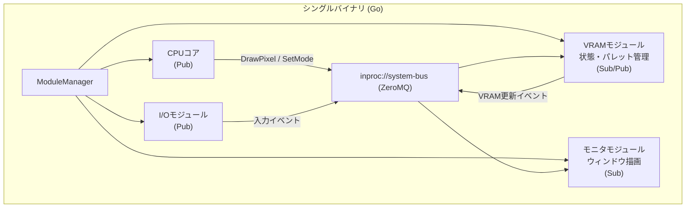

# レトロゲーム機風 モジュラー・ソフトウェアアーキテクチャ仕様書

## 1. 背景 (Background)

### 1.1. コンセプト
かつてのレトロゲーム機（MSX、ファミコンなど）は、CPUバス・拡張スロットを介してハードウェアモジュールを「ブロックのように組み合わせる」設計思想を持っていた。
本プロジェクトでは、この思想を現代のソフトウェア技術で再現する。

### 1.2. 目指す世界観
- 単一のバイナリ（シングルバイナリ）内で、各仮想ハードウェアモジュールが **独立した並行プロセス** として動作する
- 各モジュールは **疎結合なメッセージングバス** を通じてのみ連携する
- ユーザーは「ソフトウェアのレゴブロック」を組み合わせるようにシステムを構築できる

### 1.3. 現在の課題
- プロジェクト `Metov` は初期化段階であり、コアアーキテクチャがまだ存在しない
- `features/vm/` にスケルトンコードがあるのみで、バスシステムやモジュール基盤の実装が必要

---

## 2. 要件 (Requirements)

### 2.1. 必須要件 (Must Have)

#### R-001: システムバス基盤
- ZeroMQ (ZMQ) を用いた Pub/Sub ベースのメッセージングバスを実装する
- バスは以下の2つのプロトコルを **同一ソケット** に対して同時にバインドする（デュアル・バインディング）:
  - **内部バス** (`inproc://system-bus`): プロセス内通信。Goroutine間の高速データ交換用
  - **外部バス** (`tcp://127.0.0.1:5555`): 外部プロセス接続用のTCPポート
- 内部バスと外部バスには **同一のメッセージ** が流れること

#### R-002: メモリマップドI/O機能と抽象コマンドメッセージング
- モジュール間の連携は生のメモリアクセスだけでなく、**抽象化されたコマンドの送信** やアドレス空間への書き込みによって駆動する。
- メッセージフォーマットは以下の情報を含む:
  - **対象 (Target/Address)**: コマンドの対象やメモリアドレス
  - **操作種別 (Operation)**: Write / Read / Command などの種別
  - **データ (Data)**: 書き込みデータやコマンド引数
  - **送信元 (Source)**: モジュール名

#### R-003: モジュール・ライフサイクル管理
- 各モジュールは独立した Goroutine として起動する
- モジュールの起動・停止・ステータス管理を行う **ModuleManager** を実装する
- モジュールは共通インターフェース（`Start()`, `Stop()` 等）を実装する

#### R-004: 基本モジュール群の実装
以下の基本モジュールを実装する（サウンド機能は別フェーズとする）:

1. **CPUコアモジュール** (Publisher / Subscriber)
   - メインの演算処理 / ゲームロジックを担当する起点モジュール。
   - ディスプレイに対する描画コマンドや、パレット変更コマンドをバスに Publish する。

2. **VRAMモジュール** (Subscriber / Publisher)
   - 画面の論理的な状態（解像度、カラービット数、パレット、ピクセルデータ）を保持・管理する。
   - 受信した画像操作コマンドによって内部状態を更新し、変更イベントを Publish する。
   - **サポートする主な操作:**
     - `SetMode`: モード変更（解像度とカラービット数の指定。デフォルトは 256x212, 8bit）
     - `DrawPixel`: 指定座標 `(x,y)` にパレット番号 `p` を描画
     - `BlockTransfer`: 範囲 `(x,y)` から `(x+w, y+h)` への矩形描画/データ転送
     - `UpdatePalette`: パレット情報の更新
   - **パレット管理:**
     - VRAMのピクセルデータは絶対色（RGB）ではなく「パレット番号」を保持する。
     - 初期化時、カラービット数 `x` に応じて自動計算されたデフォルトパレットを生成する。（例: 0は透明色。RGB各色への段階的なビット割り当て計算式を用いる）。
     - パレット情報の変更によって、画面全体の色味が即座に変更可能とする。

3. **ディスプレイモニタモジュール** (Subscriber)
   - VRAMモジュールから Publish されるモード変更イベントや描画イベントを受信し、実際のウィンドウに描画する。
   - **UI基盤:** `gomobile` などのモバイルフレームワークを基軸とした設計とし、ウィンドウをモードで指定された解像度に合わせて表示する。
   - パレット番号から実際の色への変換を行い、ピクセル単位で画面へプロットする。
   - パレット更新イベントを受け取った際は、全体の描画色を再計算する。
   - **Headless対応:** アプリ起動オプションに `--headless` が指定された場合は、ウィンドウを表示せず描画処理をスキップする。

4. **I/O / コントローラーモジュール** (Publisher)
   - 入力イベント（キーボード操作等）を検知し、状態をバスに Publish する。

### 2.2. 任意要件 (Nice to Have)

#### R-005: 外部バス活用ユースケース
デュアル・バインディングを利用し、メインバイナリを変更せずに外部から接続可能な以下のツールをサポートする（本フェーズでは設計のみ）:
- **リアルタイム・デバッガ**: システムバスの全トラフィックを傍受・表示
- **ネットワーク・セカンドモニタ**: LAN越しにVRAMイベントを購読してリモート描画

#### R-006: シングルバイナリ配布
- `go build` により単一の実行可能バイナリを生成し、ポン置き可能とすること。

---

## 3. 実現方針 (Implementation Approach)

### 3.1. 技術スタック

| 技術 | 用途 | 選定理由 |
|---|---|---|
| **Go 1.24+** | 実装言語 | 軽量並行処理、シングルバイナリ |
| **ZeroMQ (go-zmq4)** | メッセージングバス | `inproc`/`tcp` デュアルバインド対応 |
| **encoding/binary** | メッセージシリアライズ | 初期実装用。将来はMessagePack等を適宜検討。 |
| **gomobile (golang.org/x/mobile)** 等 | 画面描画基盤 | モバイル向けフレームワークをPCウィンドウ描画の基軸とする要件に対応 |

### 3.2. アーキテクチャ概要



### 3.3. 設計上の重要な決定事項
1. **サウンド実装の延期**: APU / サウンドモジュールの実装は別フェーズで行う。
2. **抽象画像操作**: バスの通信は低レイヤのメモリ書き込みだけでなく、解像度やパレットを伴う高レイヤの描画コマンドに対応する。
3. **Headlessモード対応**: モニタモジュール側にフラグを渡し、起動と描画ループを安全に制御・スキップする基盤を整備する。

---

## 4. 検証シナリオ (Verification Scenarios)

### シナリオ 1: VRAM モード変更とパレットを利用した描画
1. `ModuleManager` がモジュール（CPU, VRAM, モニタ）を起動する。
2. CPUモジュールが `SetMode(width: 256, height: 212, colors: 8bit)` コマンドを Publish する。
3. VRAMモジュールがモードを変更し、デフォルトパレットを初期化後、`ModeChanged` イベントを Publish する。
4. モニタモジュールがウィンドウサイズを `256x212` にリサイズする。
5. CPUモジュールが `DrawPixel(x:10, y:10, palette: 5)` と `BlockTransfer(...)` コマンドを Publish する。
6. VRAMモジュールが内部バッファの該当ピクセル値を更新し、`VRAMUpdated` イベントを Publish する。
7. モニタモジュールがイベントを検知し、パレットの5番に基づく色で画面（または矩形領域）をプロットする。
8. CPUモジュールが `UpdatePalette(palette: 5, RGB値)` を Publish すると、VRAM・モニタが連携し、既に描画されているパレット5の領域が指示通りの色へ即座に変わる。

### シナリオ 2: Headless モードの動作確認
1. `vm --headless` 引数をつけて起動する。
2. シナリオ1と同様のコマンドシーケンスが発行される。
3. VRAMのバッファ更新自体は行われるが、モニタモジュールのウィンドウ表示処理は起動せず、描画負荷やGUIエラーが発生しないことを確認する。

### シナリオ 3: 外部バス経由のメッセージ傍受
1. メインプロセス実行中に、別プロセスの外部クライアントが TCP (5555番ポート) に接続する。
2. VRAM更新イベントやコントローラの入力イベントが、外部クライアントで同一の内容として取得できることを確認する。

---

## 5. テスト項目 (Testing for the Requirements)

すべてのテストは自動化され、以下のスクリプトで検証可能とする。

### 5.1. 単体テスト

| 要件 | テストケース | 検証内容 | 検証コマンド |
|---|---|---|---|
| R-001 | `bus/zmqbus_test.go` | ZMQ バスの初期化、デュアルバインド | `scripts/process/build.sh` |
| R-002, R-004 | `modules/vram/vram_test.go` | VRAMのモード変更、パレット計算ロジック、ピクセル・ブロック転送のインメモリ操作 | `scripts/process/build.sh` |
| R-003, R-004 | `modules/monitor/monitor_test.go`| Headless モード時のスキップ処理 | `scripts/process/build.sh` |

### 5.2. 統合テスト

| 要件 | テストケース | 検証内容 | 検証コマンド |
|---|---|---|---|
| R-001, R-004 | `integration/vram_monitor_test.go` | VRAMの更新イベントがモニタモジュールへ正しく伝搬するか確認 (Headless運用) | `scripts/process/integration_test.sh` |

### 5.3. 検証手順

```bash
# 1. 全体ビルドと単体テスト
scripts/process/build.sh

# 2. 統合テスト
scripts/process/integration_test.sh
```

---

## 6. 今後の拡張（参考情報）

- **サウンド生成 (APU)**: 矩形波・ノイズ生成ロジックの実装
- **ゲームROM読み込み**: バイナリデータをロードしてCPUモジュールに供給する機能
