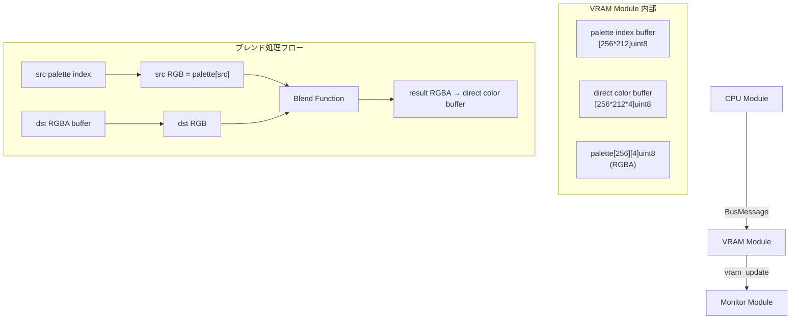

# 006-VRAMEnhancement

## 1. 背景 (Background)

現在のVRAMモジュールは `draw_pixel`（1ピクセル単位の描画）と `set_palette`（1色単位のパレット設定）のみをサポートしている。実用的なゲーム描画やアプリケーション開発においては、以下の機能が不足している:

- **矩形ブロック転送**: スプライトやタイル画像をVRAMに一括書き込み/読み出しする手段がない。1ピクセルずつの転送では非常に非効率。
- **回転・拡大**: レトロゲーム機（GBA, SNES Mode7 等）に見られるアフィン変換機能がない。
- **VRAM間コピー**: スクロールやダブルバッファリング等に必要な、VRAM内の矩形領域のコピーが行えない。
- **VRAM初期化**: 画面クリア等で特定のパレット色でVRAM全体を一括で埋める機能がない。
- **パレットの一括転送**: パレットの読み書きが1色単位であり、256色一括などの効率的な転送ができない。
- **アルファチャンネル**: 現在のパレットは RGB 3バイトのみで、アルファ（透明度）をサポートしていない。
- **ブレンド描画**: 半透明オーバーレイやフェード効果など、既存のVRAM値と新しい描画値をアルファ合成して書き込む機能がない。

これらの機能を追加することで、より本格的なレトロゲーム描画エンジンとしての能力を備える。

## 2. 要件 (Requirements)

### 2.1 必須要件

#### REQ-1: パレットのRGBA拡張
- パレット構造を `[256][3]uint8` (RGB) から `[256][4]uint8` (RGBA) へ拡張する。
- 既存の `set_palette` コマンドは後方互換を維持しつつ、RGBA対応版も追加する。
- アルファ値 `0` = 完全透明、`255` = 完全不透明。

#### REQ-2: 矩形VRAMブロック書き込み (`blit_rect`)
- 指定された矩形領域 (x, y, width, height) に対してパレットインデックスの2Dデータを一括で書き込む。
- 処理速度の観点から、通常書き込みと変換付き書き込みは命令を分離する。
- VRAM領域をはみ出た部分はクリッピングされる（REQ-10参照）。

#### REQ-3: 矩形VRAMブロック書き込み＋変換 (`blit_rect_transform`)
- 矩形ブロック書き込みに加えて、以下のアフィン変換パラメータを指定可能:
  - **回転角度**: 0〜360度（256段階のステップで指定。0=0度, 64=90度, 128=180度, 192=270度）
  - **回転軸 (pivot)**: ソース矩形内のローカル座標 (pivot_x, pivot_y) で指定する。回転・拡大はこの点を中心として行われる。例えば、キャラクターの足元を軸にして回転させたい場合は、足元の座標を指定する。
  - **拡大率**: X方向/Y方向それぞれ。固定小数点で指定（8.8フォーマット: 上位8bit=整数部, 下位8bit=小数部。0x0100=等倍）
- 転送先座標 (dst_x, dst_y) は、回転軸が配置される画面上の位置を示す。
- VRAM領域をはみ出た部分はクリッピングされる（REQ-10参照）。

#### REQ-4: 矩形VRAMブロック読み出し (`read_rect`)
- 指定された矩形領域 (x, y, width, height) のパレットインデックスデータを取得する。
- レスポンスとしてバスに読み出し結果をパブリッシュする。

#### REQ-5: 矩形VRAMコピー (`copy_rect`)
- VRAM内の矩形領域 (src_x, src_y, width, height) を別の位置 (dst_x, dst_y) にコピーする。
- ソースとデスティネーションが重なる場合も正しく動作すること（内部で一時バッファを使用）。
- スクロール実装や画面部分更新に利用可能。
- コピー先がVRAM領域をはみ出た部分はクリッピングされる（REQ-10参照）。

#### REQ-6: VRAM初期化 (`clear_vram`)
- 指定されたパレットインデックス値でVRAM全体を埋める。
- パレットインデックスを省略した場合はインデックス `0` で初期化する。

#### REQ-7: パレットブロック書き込み (`set_palette_block`)
- 複数のパレットエントリをまとめて書き込む。
- 開始インデックスと連続するRGBAデータを指定して一括設定する。

#### REQ-8: パレットブロック読み出し (`read_palette_block`)
- 指定した開始インデックスから連続するパレットエントリを読み出す。
- レスポンスとしてバスに読み出し結果をパブリッシュする。

#### REQ-9: アルファブレンド描画
- VRAMへの書き込み時に、書き込むピクセルのパレットのアルファ値を参照してブレンドモードで描画する機能。
- ブレンドは `blit_rect` / `blit_rect_transform` コマンドのフラグで有効化する。
- 以下のブレンドモードをサポートする:

| モードID | モード名 | 計算式 | 用途 |
|----------|----------|--------|------|
| `0x00` | **Replace (上書き)** | `dst = src` | デフォルト。ブレンドなし |
| `0x01` | **Alpha Blend (通常合成)** | `dst = src * α + dst * (1 - α)` | 半透明オーバーレイ、ウィンドウ |
| `0x02` | **Additive (加算合成)** | `dst = min(src * α + dst, 255)` | 光、パーティクル、爆発エフェクト |
| `0x03` | **Multiply (乗算合成)** | `dst = src * dst / 255` | 影、暗いフィルタ |
| `0x04` | **Screen (スクリーン合成)** | `dst = 255 - (255 - src) * (255 - dst) / 255` | 明るいフィルタ、グロー |

- ブレンド計算は各ピクセルの書き込み時に適用される。
- `α` は書き込むピクセルのパレットエントリに含まれるアルファ値 (0〜255) を 0.0〜1.0 に正規化したもの。
- ブレンドの対象は最終的なRGB値（パレットを経由して解決済みの値）同士で行う。
  - 具体的には: `src_rgb = palette[src_index].RGB`, `dst_rgb = palette[dst_vram[pixel]].RGB` で両方のRGBを求め、ブレンド計算後の結果を表現するパレットインデックスに戻すのではなく、**VRAM書き込み前にRGBレベルでブレンドし、その結果を「直接色バッファ」に反映する方式**を採用する（後述の実現方針を参照）。

#### REQ-10: VRAM境界クリッピング
- すべてのVRAM書き込み操作（`draw_pixel`, `blit_rect`, `blit_rect_transform`, `copy_rect`）において、書き込み先がVRAM領域 (0,0)〜(width-1, height-1) の範囲外にはみ出た場合、はみ出た部分は**自動的にクリッピング（切り捨て）**される。
- クリッピングはエラーとせず、範囲内の有効なピクセルのみが書き込まれる。
- 完全にVRAM領域外への書き込み（矩形が全く重ならないケース）は、何も書き込まずに正常終了する。
- 読み出し操作（`read_rect`）でも同様に、範囲外の部分はパレットインデックス `0` として返す。

#### REQ-11: デモプログラム
- 新規追加した各VRAM機能を視覚的に確認できるデモプログラムを、CPUモジュール内のデモロジックとして実装する。
- 既存のレインボーブロック＋パレットアニメーションデモを置き換え、以下のデモシーンを順次表示する:

| シーン | 表示内容 | 使用機能 |
|--------|----------|----------|
| **Scene 1: パレット一括設定 + VRAM初期化** | 256色グラデーションパレットを一括設定し、`clear_vram` で背景色を塗りつぶす | `set_palette_block`, `clear_vram` |
| **Scene 2: 矩形ブロック転送** | チェッカーパターンやカラーバーなどの矩形を画面上に複数配置 | `blit_rect` |
| **Scene 3: アフィン変換** | スプライト的な矩形を回転・拡大しながら描画。回転軸の違いによる動きの差も見せる | `blit_rect_transform` |
| **Scene 4: アルファブレンド** | 背景にベタ塗り矩形を描画し、その上に半透明の矩形を各ブレンドモードで重ねて表示 | `blit_rect` + ブレンドモード |
| **Scene 5: スクロール** | パターンを描画後、`copy_rect` でY方向にスクロールアニメーション | `copy_rect` |

- 各シーンは一定時間（例: 3秒）ごとに自動で切り替わるか、全シーンを画面分割で同時表示する。
- デモは `cpu.go` 内の `run()` メソッドで実行する（既存デモの拡張/置き換え）。

### 2.2 任意要件

- **ブレンドモードの追加**: 将来的にSubtract（減算）やOverlay等のモード追加を容易にする設計とすること。

## 3. 実現方針 (Implementation Approach)

### 3.1 アーキテクチャ概要



### 3.2 VRAMの二重バッファ構造

ブレンド描画をサポートするため、VRAMは以下の2つのバッファを持つ:

1. **パレットインデックスバッファ** (`indexBuffer []uint8`): 従来通りのパレットインデックスを保持。ブレンドなし (`Replace`) モードの描画で使用。
2. **直接色バッファ** (`colorBuffer []uint8`, RGBA形式): ブレンド演算の結果をRGBA値で保持。ブレンドありの描画で使用。

- Replace モード: `indexBuffer` を更新し、`colorBuffer` にはパレット引きした結果を書き込む。
- ブレンドモード: `colorBuffer` のみを更新し、`indexBuffer` は `0xFF` (ダイレクトカラーマーカー) に設定する。
- Monitor モジュールが `buildFrame()` でテクスチャを生成する際:
  - `indexBuffer[i]` が `0xFF` の場合は `colorBuffer` から直接RGBA値を使用。
  - それ以外の場合は従来通り `palette[indexBuffer[i]]` を使用。

### 3.3 コマンドデータフォーマット

#### `blit_rect` (Target: `"blit_rect"`)
```
[dst_x:uint16][dst_y:uint16][width:uint16][height:uint16][blend_mode:uint8][pixel_data:uint8[width*height]]
```

#### `blit_rect_transform` (Target: `"blit_rect_transform"`)
```
[dst_x:uint16][dst_y:uint16][src_width:uint16][src_height:uint16]
[pivot_x:uint16][pivot_y:uint16]
[rotation:uint8][scale_x:uint16][scale_y:uint16][blend_mode:uint8]
[pixel_data:uint8[src_width*src_height]]
```
- `dst_x`, `dst_y`: 回転軸 (pivot) が配置されるVRAM上の座標
- `pivot_x`, `pivot_y`: ソース矩形内のローカル座標。回転・拡大の中心点
- `rotation`: 0〜255 (0=0°, 64=90°, 128=180°, 192=270°)
- `scale_x`, `scale_y`: 8.8 固定小数点 (0x0100 = 1.0倍)

#### `read_rect` (Target: `"read_rect"`)
```
[x:uint16][y:uint16][width:uint16][height:uint16]
```
レスポンス (Target: `"rect_data"`):
```
[x:uint16][y:uint16][width:uint16][height:uint16][pixel_data:uint8[width*height]]
```

#### `copy_rect` (Target: `"copy_rect"`)
```
[src_x:uint16][src_y:uint16][dst_x:uint16][dst_y:uint16][width:uint16][height:uint16]
```

#### `clear_vram` (Target: `"clear_vram"`)
```
[palette_index:uint8]
```
省略時（空データ）はインデックス `0` で初期化。

#### `set_palette` 拡張 (Target: `"set_palette"`)
- 既存 (4バイト): `[index:uint8][R:uint8][G:uint8][B:uint8]` — 後方互換。アルファは `255` として扱う。
- 拡張 (5バイト): `[index:uint8][R:uint8][G:uint8][B:uint8][A:uint8]`

#### `set_palette_block` (Target: `"set_palette_block"`)
```
[start_index:uint8][count:uint8][R:uint8][G:uint8][B:uint8][A:uint8]... (count回繰り返し)
```

#### `read_palette_block` (Target: `"read_palette_block"`)
```
[start_index:uint8][count:uint8]
```
レスポンス (Target: `"palette_data"`):
```
[start_index:uint8][count:uint8][R:uint8][G:uint8][B:uint8][A:uint8]... (count回繰り返し)
```

### 3.4 変更対象ファイル

| ファイル | 変更内容 |
|----------|----------|
| `features/neurom/internal/modules/vram/vram.go` | パレットRGBA化、二重バッファ、新コマンド処理、ブレンド関数 |
| `features/neurom/internal/modules/vram/blend.go` | ブレンド計算ロジック (新規) |
| `features/neurom/internal/modules/vram/transform.go` | アフィン変換ロジック (新規) |
| `features/neurom/internal/modules/vram/vram_test.go` | 各コマンドの単体テスト追加 |
| `features/neurom/internal/modules/vram/blend_test.go` | ブレンド計算の単体テスト (新規) |
| `features/neurom/internal/modules/vram/transform_test.go` | アフィン変換の単体テスト (新規) |
| `features/neurom/internal/modules/monitor/monitor.go` | パレットRGBA対応、`buildFrame` での直接色バッファ参照 |
| `features/neurom/internal/bus/message.go` | 必要に応じてレスポンス用の定数追加 |
| `features/neurom/internal/modules/cpu/cpu.go` | デモプログラムの実装（既存デモの置き換え） |

### 3.5 ブレンド関数の設計

```go
// BlendMode represents the pixel blending mode.
type BlendMode uint8

const (
    BlendReplace  BlendMode = 0x00
    BlendAlpha    BlendMode = 0x01
    BlendAdditive BlendMode = 0x02
    BlendMultiply BlendMode = 0x03
    BlendScreen   BlendMode = 0x04
)

// BlendPixel computes the blended RGBA output for a single pixel.
// src/dst are [R, G, B, A] arrays; alpha is src[3] normalized to 0.0-1.0.
func BlendPixel(mode BlendMode, src, dst [4]uint8) [4]uint8
```

### 3.6 アフィン変換の設計

逆変換アプローチを使用する:
1. 出力先の各ピクセルに対してループ
2. 回転軸 (pivot) を原点としたローカル座標系でアフィン逆変換を適用し、ソース座標を算出
3. ソース座標が範囲内ならピクセル値を取得、範囲外なら透明（書き込みスキップ）
4. 書き込み先がVRAM境界外の場合はクリッピング

```go
// TransformBlit applies rotation and scaling to source pixel data
// around the specified pivot point, and writes the result to the destination buffer.
func TransformBlit(
    src []uint8, srcW, srcH int,
    pivotX, pivotY int, // rotation/scale center in source-local coords
    rotation uint8,
    scaleX, scaleY uint16, // 8.8 fixed-point
) (dst []uint8, dstW, dstH int)
```

### 3.7 クリッピング処理

すべての書き込み操作で共通のクリッピングロジックを適用する:

```go
// ClipRect clips a rectangle (x, y, w, h) against the VRAM bounds (vramW, vramH).
// Returns the clipped rectangle and the offset into the source data.
// If the rectangle is completely outside, returns (0, 0, 0, 0, 0, 0).
func ClipRect(x, y, w, h, vramW, vramH int) (cx, cy, cw, ch, srcOffX, srcOffY int)
```

- `blit_rect` / `blit_rect_transform`: 書き込み先座標をクリッピングし、ソースデータの対応部分のみ書き込む
- `copy_rect`: コピー先座標をクリッピング
- `draw_pixel`: 既存の `x < v.width && y < v.height` チェックが相当（変更不要）

### 3.8 デモプログラムの設計

既存の `cpu.go` の `run()` メソッド内のデモロジックを置き換える。デモはシーンベースの構成とし、タイマーで自動進行する。

```
run() のフロー:
1. VRAMモード初期化
2. シーンテーブルの定義 (initFunc, updateFunc のペア)
3. 現在シーンの initFunc 実行
4. tickerループ:
   - updateFunc を毎フレーム実行
   - 一定時間経過で次シーンへ
   - 最後のシーン後は最初にループ
```

#### 各シーンの実装概要

**Scene 1: パレット一括設定 + VRAM初期化**
- `set_palette_block` で0〜255番までHSVグラデーションパレットを設定
- `clear_vram` で背景色を塗りつぶし
- フレームごとに `clear_vram` のインデックスを変えて背景色アニメーション

**Scene 2: 矩形ブロック転送**
- 8x8 のチェッカーパターンをプログラム内で生成
- `blit_rect` で画面上にタイル状に並べて描画
- フレームごとに色を変えてアニメーション

**Scene 3: アフィン変換**
- 矢印型のスプライトデータをプログラム内で定義
- 画面中央で回転アニメーション（中心pivot）
- 画面左側で足元pivotの回転、画面右側で2倍拡大+回転を同時表示

**Scene 4: アルファブレンド**
- 背景に赤・緑・青の3本の縦バーを描画
- 白色半透明 (α=128) の矩形を5つのブレンドモードでそれぞれ重ねて描画
- 各ブレンドモードの違いが視覚的に比較可能

**Scene 5: スクロール**
- カラフルなパターンを画面全体に描画
- `copy_rect` でY方向に毎フレームスクロール
- スクロールで空いた行を新しいパターンで埋める

## 4. 検証シナリオ (Verification Scenarios)

### シナリオ 1: 矩形ブロック書き込みと読み出し
1. VRAMを初期化 (パレット `0` で `clear_vram`)
2. 4x4 の矩形データ（全ピクセルがパレットインデックス `5`）を `blit_rect` で座標 (10, 20) に書き込む
3. `read_rect` で同じ座標 (10, 20, 4, 4) を読み出す
4. 読み出したデータが全て `5` であることを確認
5. 周囲のピクセル（座標 (9, 20) や (14, 20)）が `0` のままであることを確認

### シナリオ 2: VRAM コピーによるスクロール
1. VRAMの座標 (0, 0) から (32, 32) の矩形にパターンデータを書き込む
2. `copy_rect` で (0, 0) から (0, 8) に (32, 32) の矩形をコピー（Y方向に8ピクセルスクロール）
3. コピー先 (0, 8) の内容がコピー元と一致することを確認
4. ソースとデスティネーションの重なり部分が正しく処理されていることを確認

### シナリオ 3: アフィン変換付きブロック転送
1. 8x8 のスプライトデータを用意
2. `blit_rect_transform` で回転軸をソース中心 (pivot=4,4)、90度回転 (rotation=64) 、等倍 (scale=0x0100) を指定して書き込む
3. 結果の各ピクセルが期待通り、中心を軸に90度回転した位置にあることを確認
4. 2倍拡大 (scale=0x0200) で書き込み、出力が16x16ピクセルに拡大されていることを確認
5. 回転軸を左上 (pivot=0,0) に変更して再度回転し、結果が異なることを確認

### シナリオ 3b: クリッピング動作
1. VRAMサイズ 256x212 の環境で、座標 (250, 200) に 16x16 の矩形を `blit_rect` で書き込む
2. 範囲内のピクセル（250〜255, 200〜211）のみが書き込まれていることを確認
3. 範囲外（x=256以降、y=212以降）に書き込みが発生していないことを確認
4. 完全に範囲外の座標 (300, 300) に矩形を書き込み、エラーなく正常終了することを確認

### シナリオ 4: アルファブレンド描画
1. パレットインデックス `1` を赤 (255, 0, 0, 255) に、インデックス `2` を青 (0, 0, 255, 128) に設定
2. VRAMに赤 (インデックス `1`) のベタ塗り矩形を描画
3. その上にブレンドモード `Alpha` (0x01) で青 (インデックス `2`, α=128≈0.5) の矩形を描画
4. 重なり部分の直接色バッファが紫系の色 (127, 0, 128, 255) に近い値であることを確認

### シナリオ 5: パレットブロック転送
1. 16色分のRGBAデータを用意
2. `set_palette_block` で開始インデックス `0` から16色を一括設定
3. `read_palette_block` で読み出し、設定値と一致することを確認

### シナリオ 6: VRAM初期化
1. VRAMに何らかのパターンを書き込み済みの状態にする
2. `clear_vram` をパレットインデックス `3` で実行する
3. VRAMの全ピクセルがインデックス `3` であることを確認

### シナリオ 7: デモプログラム
1. システムを非ヘッドレスモードで起動する
2. Scene 1: 背景色がパレットサイクリングで変化することを確認
3. Scene 2: チェッカーパターンがタイル状に表示されることを確認
4. Scene 3: スプライトが回転・拡大アニメーションすることを確認
5. Scene 4: 5つのブレンドモードの違いが視覚的に確認できること
6. Scene 5: スクロールアニメーションがスムーズに動作することを確認
7. 全シーンを通してクラッシュやハングが発生しないことを確認

## 5. テスト項目 (Testing for the Requirements)

### 単体テスト

| テストファイル | テスト内容 | 対応要件 |
|----------------|-----------|----------|
| `vram/vram_test.go` | `TestBlitRect` — 矩形ブロック書き込みと境界チェック | REQ-2 |
| `vram/vram_test.go` | `TestReadRect` — 矩形読み出しとレスポンスメッセージ検証 | REQ-4 |
| `vram/vram_test.go` | `TestCopyRect` — 重なりあり/なしのコピー検証 | REQ-5 |
| `vram/vram_test.go` | `TestClearVRAM` — 全ピクセル初期化の確認 | REQ-6 |
| `vram/vram_test.go` | `TestSetPaletteRGBA` — 後方互換RGB / RGBA拡張 | REQ-1 |
| `vram/vram_test.go` | `TestSetPaletteBlock` — パレット一括書き込み | REQ-7 |
| `vram/vram_test.go` | `TestReadPaletteBlock` — パレット一括読み出し | REQ-8 |
| `vram/blend_test.go` | `TestBlendReplace` — 上書きモードの検証 | REQ-9 |
| `vram/blend_test.go` | `TestBlendAlpha` — 通常合成の計算精度検証 | REQ-9 |
| `vram/blend_test.go` | `TestBlendAdditive` — 加算合成とクランプ検証 | REQ-9 |
| `vram/blend_test.go` | `TestBlendMultiply` — 乗算合成の検証 | REQ-9 |
| `vram/blend_test.go` | `TestBlendScreen` — スクリーン合成の検証 | REQ-9 |
| `vram/transform_test.go` | `TestRotation90` — 中心pivot指定での90度回転の検証 | REQ-3 |
| `vram/transform_test.go` | `TestRotationWithCustomPivot` — 任意pivot指定での回転結果の検証 | REQ-3 |
| `vram/transform_test.go` | `TestScale2x` — 2倍拡大の検証 | REQ-3 |
| `vram/transform_test.go` | `TestRotateAndScale` — 回転+拡大の複合変換 | REQ-3 |
| `vram/vram_test.go` | `TestBlitRectClipping` — VRAM境界でのクリッピング | REQ-10 |
| `vram/vram_test.go` | `TestBlitRectFullyOutside` — 完全に範囲外への書き込み | REQ-10 |
| `vram/vram_test.go` | `TestCopyRectClipping` — コピー先のクリッピング | REQ-10 |

### 統合テスト

| テスト | 内容 | 実行コマンド |
|--------|------|-------------|
| `TestBlitAndReadRect` | CPU→VRAM→Monitor の矩形転送パイプライン検証 | `./scripts/process/integration_test.sh --specify "TestBlitAndReadRect"` |
| `TestAlphaBlendPipeline` | ブレンド描画結果がMonitorのRGBAバッファに正しく反映されるか | `./scripts/process/integration_test.sh --specify "TestAlphaBlendPipeline"` |
| `TestDemoProgram` | デモプログラムがクラッシュせず一定時間実行できるか（headlessモード） | `./scripts/process/integration_test.sh --specify "TestDemoProgram"` |

### 検証コマンド

```bash
# 全体ビルド + 単体テスト
./scripts/process/build.sh

# 統合テスト
./scripts/process/integration_test.sh
```
