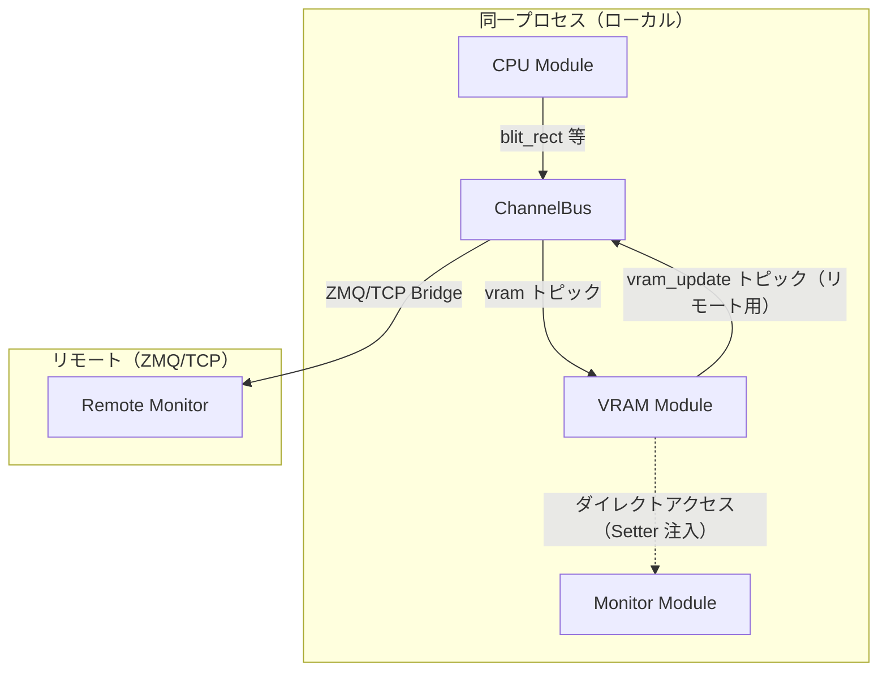

# 009-VRAMEventSync

## 背景 (Background)

### 現状の問題

Monitor モジュールは VRAM の独立したコピー (`m.vram`) を保持し、Bus 経由の `rect_updated` イベントで同期している。しかし、大きな矩形操作（>4096 ピクセル）では header-only フォーマット（ピクセルデータなし）が送信されるため、Monitor の内部バッファが更新されず、表示が壊れる。

| 操作 | 典型的なピクセル数 | イベント形式 | Monitor 表示 |
|:--|:--|:--|:--|
| `copy_rect(0,1→0,0, 256×211)` (全画面スクロール) | 54016 | header-only | **反映されない** |
| `blit_rect(0,0, 256×212)` (全画面書き込み) | 54272 | header-only | **反映されない** |
| `blit_rect(0,0, 85×212)` (大きな矩形) | 18020 | header-only | **反映されない** |
| `blit_rect(10,10, 8×8)` (小さな矩形) | 64 | full | 正常 |

### 根本的な設計問題

1. **VRAM の二重管理**: VRAM モジュールと Monitor モジュールがそれぞれ独立した VRAM バッファを持ち、イベントで同期する設計は、同一プロセス内では不必要な複雑さとバグの温床になっている
2. **リフレッシュモデル**: Monitor は「イベント駆動」で動作しており、自発的なリフレッシュサイクルを持たない。実機のディスプレイのように、定期的に VRAM を読み取って表示する方が自然

### ZMQ の価値

一方で、Bus (ZMQ/TCP) を介したイベント駆動モデルには価値がある:
- **リモートモニタ**: 別マシン上のモニタアプリが ZMQ 経由で VRAM の変化を受け取り、リモートで表示できる
- **デバッグツール**: VRAM の変更を外部ツールで監視・記録できる
- **分散アーキテクチャ**: モジュールを別プロセスに分離できる柔軟性

### 方針

**2つのアクセス方式を併存させる**:
1. **Bus モード（デフォルト・リモート対応）**: Bus 経由のイベントで VRAM 同期。ZMQ/TCP での動作を基本とする
2. **ダイレクトアクセスモード（ローカル最適化）**: 同一プロセス内では Setter を介して VRAM モジュールの参照を直接注入し、Monitor が自前のリフレッシュサイクルで VRAM を直接読み取る

## 要件 (Requirements)

### 必須要件

1. **ダイレクトアクセスモード**: Monitor に VRAM モジュールへの直接参照を Setter で設定した場合、Monitor はバスイベントに依存せず、自前のタイマー（30fps 程度）で VRAM バッファを直接読み取り、画面を更新すること
2. **Bus モード**: ダイレクトアクセスが設定されていない場合、従来通り Bus 経由のイベントで VRAM を同期すること。ただし以下を改善する:
   - header-only フォーマットを廃止し、全ての `rect_updated` イベントがピクセルデータを含むこと
   - `copy_rect` は専用イベント `rect_copied` で Monitor にソース/デスト座標を通知し、Monitor 側でコピーを再現すること
3. **Consumer Driven インターフェース**: Monitor パッケージ内に VRAM アクセス用のインターフェースを定義し、VRAM モジュールの具象型への直接依存を避けること（Go のインターフェース規約に従う）
4. **Setter による注入**: `main.go` で VRAM モジュールと Monitor モジュールをそれぞれ生成した後、Setter を呼び出してダイレクトアクセスを有効化すること
5. **Monitor の内部コピー廃止（ダイレクトモード時）**: ダイレクトアクセスモードでは `m.vram` のコピーを使用せず、VRAM モジュールのバッファを直接参照すること
6. **既存テストの維持**: 全既存テスト（単体・統合）が引き続き PASS すること

### 任意要件

7. **リフレッシュレート設定**: MonitorConfig でリフレッシュレート（fps）を設定可能にする（デフォルト 30fps）
8. **モード検出ログ**: 起動時にどちらのモードで動作しているかログ出力する

## 実現方針 (Implementation Approach)

### アーキテクチャ



### A. VRAMAccessor インターフェース（Monitor パッケージ内）

Monitor パッケージに、VRAM への読み取りアクセスを定義するインターフェースを宣言する:

```go
// monitor/monitor.go 内
type VRAMAccessor interface {
    RLock()
    RUnlock()
    VRAMBuffer() []uint8       // palette index buffer (width*height)
    VRAMColorBuffer() []uint8  // RGBA buffer (width*height*4)
    VRAMPalette() [256][4]uint8
    VRAMWidth() int
    VRAMHeight() int
}
```

### B. VRAM モジュールへのアクセサメソッド追加

VRAM モジュールに、VRAMAccessor インターフェースを満たすエクスポートメソッドを追加する:

```go
// vram/vram.go 内
func (v *VRAMModule) RLock()                      { v.mu.RLock() }
func (v *VRAMModule) RUnlock()                    { v.mu.RUnlock() }
func (v *VRAMModule) VRAMBuffer() []uint8         { return v.buffer }
func (v *VRAMModule) VRAMColorBuffer() []uint8    { return v.colorBuffer }
func (v *VRAMModule) VRAMPalette() [256][4]uint8  { return v.palette }
func (v *VRAMModule) VRAMWidth() int              { return v.width }
func (v *VRAMModule) VRAMHeight() int             { return v.height }
```

### C. Monitor モジュールの変更

#### Setter

```go
func (m *MonitorModule) SetVRAMAccessor(v VRAMAccessor) {
    m.vramAccessor = v
}
```

#### ダイレクトモードのリフレッシュサイクル

`Start()` 内で、`vramAccessor` が設定済みの場合はタイマー goroutine を起動:

```go
if m.vramAccessor != nil {
    m.wg.Add(1)
    go func() {
        defer m.wg.Done()
        m.directRefreshLoop(ctx)
    }()
}
```

```go
func (m *MonitorModule) directRefreshLoop(ctx context.Context) {
    ticker := time.NewTicker(33 * time.Millisecond) // ~30fps
    defer ticker.Stop()
    for {
        select {
        case <-ctx.Done():
            return
        case <-ticker.C:
            m.refreshFromVRAM()
            m.requestPaint()
        }
    }
}

func (m *MonitorModule) refreshFromVRAM() {
    v := m.vramAccessor
    v.RLock()
    defer v.RUnlock()

    buf := v.VRAMBuffer()
    colorBuf := v.VRAMColorBuffer()
    pal := v.VRAMPalette()

    m.mu.Lock()
    defer m.mu.Unlock()

    for i := range len(buf) {
        ci := i * 4
        palIdx := buf[i]
        if palIdx == 0xFF {
            m.rgba[ci] = colorBuf[ci]
            m.rgba[ci+1] = colorBuf[ci+1]
            m.rgba[ci+2] = colorBuf[ci+2]
            m.rgba[ci+3] = colorBuf[ci+3]
        } else {
            m.rgba[ci] = pal[palIdx][0]
            m.rgba[ci+1] = pal[palIdx][1]
            m.rgba[ci+2] = pal[palIdx][2]
            m.rgba[ci+3] = 255
        }
    }
    m.dirty = true
}
```

#### Bus モードの改善

`vramAccessor` が **設定されていない** 場合は、従来通り Bus イベントで動作する。ただし:

- `copy_rect` 用に `rect_copied` イベントのハンドリングを追加（Monitor が自身の `m.vram` 上でコピーを再現）
- header-only フォーマット（mode=0x02）を廃止し、常にピクセルデータを含む full フォーマット（mode=0x01）を送信

##### `rect_copied` イベントフォーマット

```
[src_x:u16][src_y:u16][dst_x:u16][dst_y:u16][w:u16][h:u16]
```

`copy_rect` は元データのコピーであり、ピクセルデータを再送信する必要がない。Monitor が自身のバッファ上で同じコピー操作を再現すれば効率的。

##### header-only 廃止

ChannelBus ではメッセージサイズの制限がない。ZMQ/TCP 経由の場合は既存のチャンク分割機能が大きなメッセージを処理する。したがって常に full フォーマット（index + RGBA）を送信する。

### D. main.go の変更

```go
vramMod := vram.New()
mon := monitor.New(monitor.MonitorConfig{...})

// ダイレクトアクセス設定（同一プロセスの場合）
mon.SetVRAMAccessor(vramMod)

mgr.Register(cpu.New())
mgr.Register(vramMod)
mgr.Register(io.New())
mgr.Register(mon)
```

### 変更対象ファイル

| ファイル | 変更内容 |
|:--|:--|
| `features/neurom/internal/modules/vram/vram.go` | VRAMAccessor 準拠のアクセサメソッド追加。`publishRectEvent` の header-only 廃止。`handleCopyRect` で `rect_copied` イベント追加 |
| `features/neurom/internal/modules/monitor/monitor.go` | `VRAMAccessor` インターフェース定義。`SetVRAMAccessor` Setter。`directRefreshLoop` 追加。`rect_copied` ハンドリング追加。ダイレクトモード時は Bus イベントでの `m.vram` 更新をスキップ |
| `features/neurom/cmd/main.go` | `vram.New()` を変数に保持し、`mon.SetVRAMAccessor(vramMod)` を呼び出す |

## 検証シナリオ (Verification Scenarios)

### シナリオ 1: ダイレクトアクセスモードでの copy_rect 表示

1. VRAM に横縞パターンを描画（各行に異なるパレットインデックス）
2. `copy_rect` で全画面を1行上にスクロール
3. 最下行に新しい色を `blit_rect` で書き込み
4. Monitor のリフレッシュサイクルを待つ（最大 50ms）
5. Monitor の `GetPixel()` で、スクロール後の各行が正しい色を返すことを確認

### シナリオ 2: ダイレクトアクセスモードでの大きな blit_rect 表示

1. 256×212 の全画面 `blit_rect` を実行（各ピクセルに異なるパレットインデックス）
2. Monitor のリフレッシュサイクルを待つ
3. Monitor の `GetPixel()` で、任意の座標が正しい色を返すことを確認

### シナリオ 3: ダイレクトアクセスモードでの AlphaBlend 表示

1. パレット設定: index=1 → 赤(255,0,0,255)、index=2 → 青(0,0,255,128)
2. 赤 2×2 を `blit_rect(Replace)` で (20,20) に描画
3. 青 2×2 を `blit_rect(AlphaBlend)` で (20,20) に上書き
4. Monitor のリフレッシュサイクルを待つ
5. Monitor の `GetPixel(20,20)` がブレンド結果 (R≈127, G=0, B≈128, A=255) を返すことを確認

### シナリオ 4: Bus モードでの copy_rect 表示（リモート相当）

1. `SetVRAMAccessor` を呼ばずに Monitor を起動（Bus モード）
2. VRAM に横縞パターンを描画
3. `copy_rect` で1行上にスクロール
4. Monitor が `rect_copied` イベントで自身の `m.vram` をコピー更新
5. Monitor の `GetPixel()` で正しい色を確認

### シナリオ 5: Bus モードでの大きな blit_rect 表示

1. `SetVRAMAccessor` を呼ばずに Monitor を起動
2. 256×212 の全画面 `blit_rect` を実行
3. Monitor が full フォーマット（header-only ではなく）でピクセルデータを受信
4. Monitor の `GetPixel()` で正しい色を確認

### シナリオ 6: モード併存の確認

1. ローカル Monitor はダイレクトアクセスで動作
2. 同時に Bus イベントも発行され続けている（リモートモニタ用）
3. Bus イベントのフォーマットが正しいことを確認

## テスト項目 (Testing for the Requirements)

### 単体テスト (`./scripts/process/build.sh`)

#### VRAM アクセサメソッド

| テスト名 | 検証内容 |
|:--|:--|
| `TestVRAMAccessorInterface` | `VRAMModule` が `VRAMAccessor` インターフェースを満たすことをコンパイル時に確認 |
| `TestVRAMAccessorValues` | `VRAMBuffer()`, `VRAMColorBuffer()`, `VRAMPalette()` が正しいバッファ参照を返すことを確認 |

#### Monitor ダイレクトモード

| テスト名 | 検証内容 |
|:--|:--|
| `TestMonitorDirect_BasicPixel` | VRAM に `draw_pixel` → リフレッシュ後 `GetPixel()` で正しい色を確認 |
| `TestMonitorDirect_CopyRect` | VRAM で `copy_rect` スクロール → リフレッシュ後に全ピクセル正しいか確認（シナリオ1） |
| `TestMonitorDirect_LargeBlit` | 256×212 全画面 `blit_rect` → リフレッシュ後に確認（シナリオ2） |
| `TestMonitorDirect_AlphaBlend` | ブレンド操作 → リフレッシュ後に RGBA 値が演算式通りか確認（シナリオ3） |

#### Monitor Bus モード

| テスト名 | 検証内容 |
|:--|:--|
| `TestMonitorBus_CopyRect` | `rect_copied` イベント受信で `m.vram` コピーが正しいか確認（シナリオ4） |
| `TestMonitorBus_LargeBlit` | header-only ではなく full フォーマットで受信し表示が正しいか確認（シナリオ5） |
| `TestMonitorBus_SmallBlit` | 既存の小さな矩形操作がリグレッションなしで動作 |

#### 既存テストのリグレッション

| テスト名 | 検証内容 |
|:--|:--|
| 既存全テスト | `TestBlitRectExact`, `TestTransformExact_*`, `TestAlphaBlendExact`, `TestScrollExact*` 等が全て PASS |

### 統合テスト (`./scripts/process/integration_test.sh`)

| テスト名 | 検証内容 |
|:--|:--|
| `TestMonitorDirectSync` | ダイレクトモードで VRAM 操作（blit/copy/blend）後の Monitor ピクセル値をエンドツーエンドで検証 |
| `TestMonitorBusSync` | Bus モードで同等の操作後の Monitor ピクセル値を検証 |
| 既存統合テスト | `TestVRAMMonitorIntegration`, `TestBlitAndReadRect`, `TestAlphaBlendPipeline` 等のリグレッションなし |
