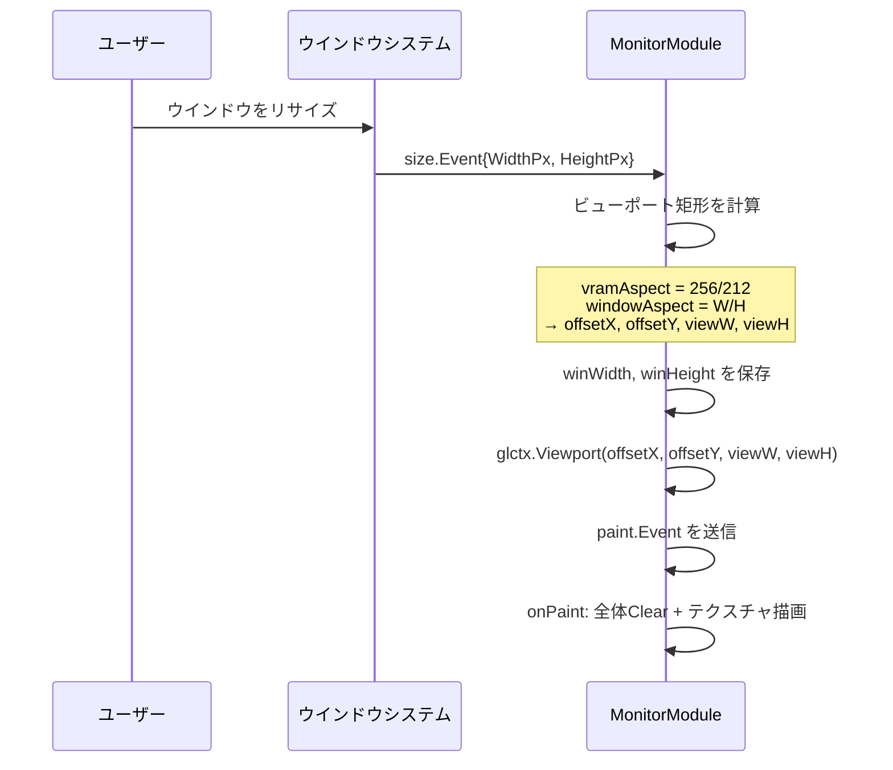

# 010: モニターウインドウのアスペクト比維持

## 背景

現在のモニターモジュール (`monitor.go`) は、VRAMの解像度 256×212 の内容をOpenGLテクスチャとしてウインドウ全体に描画している。ウインドウの `size.Event` を受け取った際、ビューポートをウインドウのサイズにそのまま設定するため、ウインドウのアスペクト比がVRAMのアスペクト比（256:212 ≈ 1.208:1）と異なる場合、描画内容が引き伸ばされて歪む。

```go
// 現在のコード (monitor.go)
case size.Event:
    if m.glctx != nil {
        m.glctx.Viewport(0, 0, e.WidthPx, e.HeightPx)
    }
```

ユーザーがウインドウをリサイズした際に、描画内容のアスペクト比が崩れないようにしたい。

## 技術的制約

`golang.org/x/mobile/app` パッケージには以下の制約がある:

- **ウインドウサイズの直接制約は不可**: `x/mobile` はネイティブウインドウハンドルへのアクセスを提供しておらず、Win32 API の `WM_SIZING` メッセージなどを利用してウインドウのリサイズを拘束する手段がない。
- **プログラムからのウインドウサイズ変更も不可**: `size.Event` は読み取り専用であり、ウインドウサイズを能動的に設定する API は存在しない。

したがって、**ウインドウ自体のサイズを拘束する方式は採用できない**。

## 要件

### 必須要件

1. **アスペクト比維持描画**: ウインドウがどのようなサイズにリサイズされても、VRAMの内容はアスペクト比 256:212 を維持して描画されること。
2. **レターボックス/ピラーボックス表示**: アスペクト比が合わない余白部分は黒（背景色）で埋められること。
   - ウインドウが横長の場合: 左右に黒帯（ピラーボックス）
   - ウインドウが縦長の場合: 上下に黒帯（レターボックス）
3. **コンテンツの中央配置**: 描画内容はウインドウの中央に配置されること。
4. **ニアレストネイバー補間の維持**: 現在のピクセルアートに適した `GL_NEAREST` フィルタリングを変更しないこと。

### 任意要件

5. **整数倍スケーリング（将来対応可）**: ピクセルパーフェクトな表示のために、整数倍のみでスケーリングするオプション。現時点では実装不要だが、将来の拡張として設計上考慮しておく。

## 実現方針

### 方式: GLビューポート調整方式

`size.Event` を受け取った際に、ウインドウサイズとVRAMアスペクト比から最適なビューポート矩形を計算し、`glctx.Viewport()` に渡す。クワッド（四角形ポリゴン）のジオメトリは現状のまま（-1,-1 ~ 1,1）で変更しない。

#### 計算ロジック

```
vramAspect = 256.0 / 212.0  (≈ 1.2075)

windowAspect = windowWidth / windowHeight

if windowAspect > vramAspect:
    // ウインドウが横長 → 左右に黒帯
    viewHeight = windowHeight
    viewWidth  = windowHeight * vramAspect
    offsetX    = (windowWidth - viewWidth) / 2
    offsetY    = 0
else:
    // ウインドウが縦長 → 上下に黒帯
    viewWidth  = windowWidth
    viewHeight = windowWidth / vramAspect
    offsetX    = 0
    offsetY    = (windowHeight - viewHeight) / 2

glctx.Viewport(offsetX, offsetY, viewWidth, viewHeight)
```

#### 変更範囲

- **`MonitorModule` 構造体**: ウインドウサイズ (`winWidth`, `winHeight`) を保持するフィールドを追加。
- **`size.Event` ハンドラ**: ビューポートの計算ロジックを実装。
- **`onPaint`**: 描画前に `glctx.Clear()` でウインドウ全体をクリア（黒帯部分のため）。ただし現在も `glctx.ClearColor(0,0,0,1)` + `glctx.Clear()` が呼ばれているため、追加の変更は最小限。

### 処理フロー



## 検証シナリオ

1. **基本アスペクト比維持**
   1. モニターをヘッドレスではないモードで起動する
   2. ウインドウを横方向に大きくリサイズする
   3. 描画内容が横に引き伸ばされず、左右に黒帯が表示されることを確認する

2. **縦方向リサイズ**
   1. ウインドウを縦方向に大きくリサイズする
   2. 描画内容が縦に引き伸ばされず、上下に黒帯が表示されることを確認する

3. **正方形ウインドウ**
   1. ウインドウを正方形にリサイズする
   2. 描画内容が正しいアスペクト比で表示され、上下に黒帯が表示されることを確認する（256:212 は横長なので、正方形ウインドウでは上下に黒帯が出る）

4. **元のアスペクト比と一致するリサイズ**
   1. ウインドウを 512×424（2倍）にリサイズする
   2. 黒帯なしで全体に描画されることを確認する

## テスト項目

### 単体テスト

`x/mobile` の OpenGL コンテキストはテスト環境では利用できないため、ビューポート計算ロジックを純粋関数として切り出し、単体テストで検証する。

| テストケース | 入力 | 期待される出力 |
|---|---|---|
| 横長ウインドウ | window: 800×400 | viewW≈483, viewH=400, offsetX≈158, offsetY=0 |
| 縦長ウインドウ | window: 400×800 | viewW=400, viewH≈331, offsetX=0, offsetY≈234 |
| 正方形ウインドウ | window: 500×500 | viewW=500, viewH≈414, offsetX=0, offsetY≈43 |
| 元のアスペクト比 | window: 512×424 | viewW=512, viewH≈424, offsetX=0, offsetY=0 |
| 最小ウインドウ | window: 1×1 | viewW=1, viewH≈0 or viewW≈1, viewH=1 (ゼロ除算なし) |

テスト実行コマンド:
```bash
scripts/process/build.sh
```

### 統合テスト

ヘッドレスモードでは OpenGL レンダリングが無効であるため、ビューポート計算のロジックテストを単体テストでカバーする。画面表示の視覚的な確認は手動で行う（これはOpenGL描画パイプラインの特性上、自動化が困難なため例外とする）。

テスト実行コマンド:
```bash
scripts/process/integration_test.sh
```
