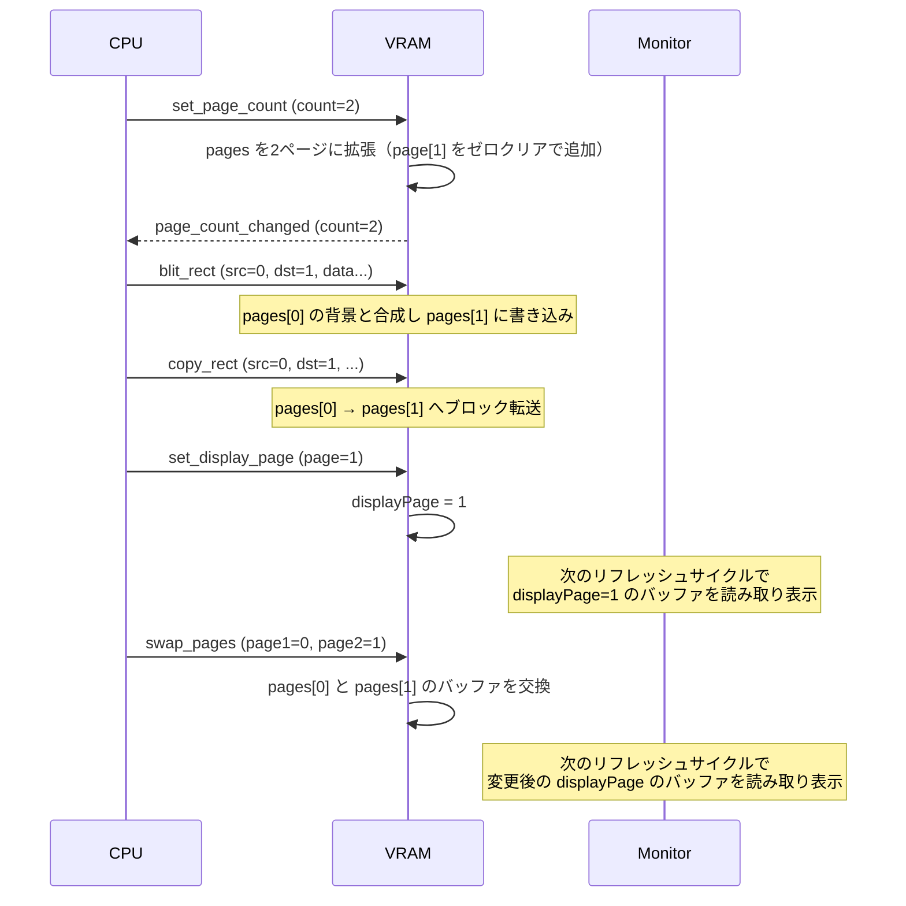

# 012 - VRAMページ機能

## 背景 (Background)

現在のVRAMモジュールは単一のバッファ（`buffer []uint8` + `colorBuffer []uint8`）で構成されており、論理的には `vram[x][y]` の2次元配列として扱われている。

レトロゲーム機やグラフィックシステムでは、複数のVRAMページを持ち、描画先ページと表示ページを独立に切り替えることで、ちらつきのないダブルバッファリングやオフスクリーン描画を実現するのが一般的である。

現在の単一バッファ構成では以下の制約がある:

- **ダブルバッファリング不可**: 描画中の中間状態がそのまま表示に反映され、ティアリングやちらつきが発生する可能性がある
- **オフスクリーン作業不可**: スプライトや背景の事前描画を別バッファで行い、完成後に表示に切り替えるといった手法が取れない
- **レイヤー合成の制約**: 複数ページを合成して最終画面を構築するような高度な描画パイプラインが実現できない

## 要件 (Requirements)

### 必須要件

#### R1: ページデータ構造の導入

- VRAMを `vram[page][x][y]` の3次元的な構造に拡張する
- 初期状態ではページ数は1（ページ0のみ）
- 各ページは独立したパレットインデックスバッファ（`[]uint8`）とRGBAカラーバッファ（`[]uint8`）を持つ
- パレットは全ページで共有する（ページごとに持たない）
- 全ページは同一の `width × height` サイズとする

#### R2: ページ数設定（Set Page Count）

VRAMのページ数を一括で設定するコマンドを提供する。`add_page` / `remove_page` のような個別操作ではなく、目標のページ数を直接指定する。

- バスコマンド `set_page_count` で実行
- 引数: `[count:u8]` — 設定するページ数
  - `1`〜`255`: そのままのページ数
  - `0`: **256ページ**として解釈する（0ページは無意味なため、レトロシステムの慣例に倣う）
- 動作:
  - **増加時（現在のページ数 < count）**: 不足分のページを末尾に追加し、ゼロクリア状態（全ピクセルがパレットインデックス0）で初期化する
  - **減少時（現在のページ数 > count）**: 末尾から超過分のページを破棄する。表示ページ（`displayPage`）が新しいページ数以上であった場合、ページ0にリセットする
  - **同一時（現在のページ数 == count）**: 何もしない
- 成功時にイベント `page_count_changed` を発行する（データに新しいページ数を含む）
- メモリ見積もり（256ページ全確保時）:
  - パレットインデックスバッファ: 256 × 256 × 212 × 1 ≈ 13.25 MB
  - RGBAカラーバッファ: 256 × 256 × 212 × 4 ≈ 53 MB
  - 合計: **約 66 MB**（使用分のみ消費）

#### R3: 表示ページ設定（Set Display Page）

- Monitorモジュールが表示するVRAMページ番号を指定する
- これはMonitorの表示設定であり、VRAMの読み書き操作には一切影響しない
- 初期値はページ0
- 存在しないページを指定した場合はエラーとする（操作を無視し、エラーイベントを発行）
- バスコマンド `set_display_page` で実行
- 成功時にイベント `display_page_changed` を発行する

#### R4: ページ操作コマンド

##### R4-1: ページスワップ（Swap Pages）

- 指定された2つのページの内容（パレットインデックスバッファとRGBAカラーバッファ）を入れ替える
- 両方のページが有効な範囲内であること（無効な場合はエラー）
- 表示ページの設定は変更しない（バッファの中身だけが入れ替わる）
- バスコマンド `swap_pages` で実行
- 成功時にイベント `pages_swapped` を発行する

##### R4-2: ページコピー（Copy Page）

- src_page のバッファ全体（パレットインデックスバッファとRGBAカラーバッファ）を dst_page にコピーする
- 矩形指定なしの全ページコピー（`copy_rect` でページ全域を指定するのと同等だが、座標指定が不要）
- 両方のページが有効な範囲内であること（無効な場合はエラー）
- src_page と dst_page が同一の場合は何もしない（冪等）
- バスコマンド `copy_page` で実行
- 成功時にイベント `page_copied` を発行する

#### R5: 全コマンドのページ引数化

ステートマシン的な「書き込みページ設定」は導入せず、**全ての描画・転送コマンドにページ番号を引数として含める**。これにより、各コマンドが操作対象のページを明示的に指定する、ステートレスな設計とする。

変更対象のコマンドと新しいバイナリフォーマット:

| コマンド | 新フォーマット | 説明 |
|---------|-------------|------|
| `draw_pixel` | `[dst_page:u8][x:u16][y:u16][p:u8]` | 指定ページにピクセルを描画 |
| `clear_vram` | `[dst_page:u8][palette_idx:u8]` | 指定ページをクリア |
| `blit_rect` | `[src_page:u8][dst_page:u8][dst_x:u16][dst_y:u16][w:u16][h:u16][blend_mode:u8][pixel_data...]` | src_page からブレンド用の既存ピクセルを読み取り、結果を dst_page に書き込む |
| `blit_rect_transform` | `[src_page:u8][dst_page:u8][dst_x:u16][dst_y:u16][src_w:u16][src_h:u16][pivot_x:u16][pivot_y:u16][rotation:u8][scale_x:u16][scale_y:u16][blend_mode:u8][pixel_data...]` | src_page からブレンド用の既存ピクセルを読み取り、変換結果を dst_page に書き込む |
| `copy_rect` | `[src_page:u8][dst_page:u8][src_x:u16][src_y:u16][dst_x:u16][dst_y:u16][w:u16][h:u16]` | ソース/デスティネーションページを個別指定してVRAM内コピー（ページ間コピー対応） |
| `read_rect` | `[src_page:u8][x:u16][y:u16][w:u16][h:u16]` | 指定ページからピクセルデータを読み取り |
| `mode` | 変更なし | 全ページのバッファを再初期化 |

- 存在しないページを指定した場合はエラー（`page_error` を発行、操作は無視）
- `blit_rect` / `blit_rect_transform` の `src_page` はブレンド計算時に背景ピクセルを読み取るページ、`dst_page` は結果を書き込むページ（`BlendReplace` モードでは `src_page` は参照されない）
- `copy_rect` は異なるページ間での転送が可能（ページAからページBへのコピー）
- `copy_rect` の同一ページ内コピーではオーバーラップ対応を維持する

#### R6: Monitorモジュールとの連携

VRAMからMonitorへ再描画を促す通知は行わない。Monitorは自身のリフレッシュサイクルでVRAMを読み取り、表示を更新する。

- **Directモード（`VRAMAccessor` 使用時）**:
  - `VRAMBuffer()`, `VRAMColorBuffer()` は表示ページ（`displayPage`）のデータを返す
  - Monitorは既存の `directRefreshLoop` のポーリング周期で自然に表示ページの内容を取得する
  - `displayPage` が変更されても、次のリフレッシュサイクルで自動的に新しいページが読み取られる
- **Busモード（イベント経由）**:
  - `vram_update` のイベントデータにページ番号を含める
  - Monitorは `displayPage` と一致するページのイベントのみ処理し、それ以外は無視する（バス帯域の節約）
  - `display_page_changed` イベント受信時、Monitorは内部キャッシュを無効化し、次のリフレッシュで表示ページ全体を再取得する
  - 表示ページに変化がない描画操作（例: 非表示ページへの書き込み）では、VRAMデータを含まないコンパクトなイベントを送信してバス帯域を節約できる

## 実現方針 (Implementation Approach)

### データ構造の変更

```go
type pageBuffer struct {
    index []uint8   // palette index buffer (width * height)
    color []uint8   // RGBA color buffer (width * height * 4)
}

type VRAMModule struct {
    mu          sync.RWMutex
    width       int
    height      int
    color       int
    pages       []pageBuffer  // pages[0] が初期ページ
    displayPage int           // 表示ページ番号（Monitor用）
    palette     [256][4]uint8
    bus         bus.Bus
    wg          sync.WaitGroup
}
```

### コマンドのバイナリレイアウト

#### ページ管理コマンド

##### `set_page_count`
- データ: `[count:u8]`（1〜255: そのままのページ数、0: 256ページ）
- 応答イベント `page_count_changed`: `[count:u8]`（設定後のページ数、同じ0=256の規則）
- エラーイベント `page_error`: `[error_code:u8]`（`0x03` = 無効ページ番号）

##### `set_display_page`
- データ: `[page:u8]`
- 応答イベント `display_page_changed`: `[page:u8]`

##### `swap_pages`
- データ: `[page1:u8][page2:u8]`
- 応答イベント `pages_swapped`: `[page1:u8][page2:u8]`

##### `copy_page`
- データ: `[src_page:u8][dst_page:u8]`
- 応答イベント `page_copied`: `[src_page:u8][dst_page:u8]`

#### 描画・転送コマンド（全てページ引数付き）

##### `draw_pixel`
- 旧: `[x:u16][y:u16][p:u8]`
- 新: `[dst_page:u8][x:u16][y:u16][p:u8]`

##### `clear_vram`
- 旧: `[palette_idx:u8]`（省略可）
- 新: `[dst_page:u8][palette_idx:u8]`（`palette_idx` は省略可、省略時は0）

##### `blit_rect`
- 旧: `[dst_x:u16][dst_y:u16][w:u16][h:u16][blend_mode:u8][pixel_data...]`
- 新: `[src_page:u8][dst_page:u8][dst_x:u16][dst_y:u16][w:u16][h:u16][blend_mode:u8][pixel_data...]`
- `src_page`: ブレンド時に背景ピクセルを読み取るページ
- `dst_page`: ブレンド結果を書き込むページ

##### `blit_rect_transform`
- 旧: `[dst_x:u16][dst_y:u16][src_w:u16][src_h:u16][pivot_x:u16][pivot_y:u16][rotation:u8][scale_x:u16][scale_y:u16][blend_mode:u8][pixel_data...]`
- 新: `[src_page:u8][dst_page:u8][dst_x:u16][dst_y:u16][src_w:u16][src_h:u16][pivot_x:u16][pivot_y:u16][rotation:u8][scale_x:u16][scale_y:u16][blend_mode:u8][pixel_data...]`
- `src_page`: ブレンド時に背景ピクセルを読み取るページ
- `dst_page`: ブレンド結果を書き込むページ

##### `copy_rect`
- 旧: `[src_x:u16][src_y:u16][dst_x:u16][dst_y:u16][w:u16][h:u16]`
- 新: `[src_page:u8][dst_page:u8][src_x:u16][src_y:u16][dst_x:u16][dst_y:u16][w:u16][h:u16]`

##### `read_rect`
- 旧: `[x:u16][y:u16][w:u16][h:u16]`
- 新: `[src_page:u8][x:u16][y:u16][w:u16][h:u16]`

### Monitorモジュールの修正

```
VRAMBuffer()      → pages[displayPage].index を返す
VRAMColorBuffer() → pages[displayPage].color を返す
```

Directモード:
- `VRAMAccessor` の既存メソッドが `displayPage` のバッファを返すため、Monitorの `directRefreshLoop` は変更不要

Busモード:
- イベントデータにページ番号を追加（既存フォーマットの先頭1バイト）
- Monitorは自身が保持する `displayPage` と一致するイベントのみ処理する
- `display_page_changed` イベント受信時、Monitor内部のキャッシュを無効化する（VRAMが再描画を指示するのではなく、Monitor自身が判断する）

### 処理フロー



## 検証シナリオ (Verification Scenarios)

### シナリオ1: ページ数の増減

1. 初期状態でページ数は1（ページ0のみ）であることを確認
2. `set_page_count` (count=4) を実行し、`page_count_changed` イベントで4が返ることを確認
3. ページ0〜3が存在し、ページ1〜3はゼロクリア状態であることを確認
4. `set_page_count` (count=2) を実行し、ページ2とページ3が破棄されたことを確認
5. `set_page_count` (count=2) を再実行し、変更なし（冪等性）であることを確認

### シナリオ2: ページ数減少時の表示ページリセット

1. `set_page_count` (count=4) でページを4つに設定
2. `set_display_page` (page=3) で表示ページをページ3に設定
3. `set_page_count` (count=2) でページ数を2に減少
4. ページ2とページ3が破棄されたことを確認
5. 表示ページがページ0にリセットされていることを確認

### シナリオ3: ページ指定による描画の分離

1. `set_page_count` (count=2) でページを2つに設定
2. `draw_pixel` でページ0の座標(10,10)にパレットインデックス1を描画
3. `draw_pixel` でページ1の同座標(10,10)にパレットインデックス2を描画
4. ページ0のバッファ(10,10)にはインデックス1が格納されていることを確認
5. ページ1のバッファ(10,10)にはインデックス2が格納されていることを確認

### シナリオ4: 表示ページの切り替え（ダブルバッファリング）

1. `set_page_count` (count=2) でページを2つに設定
2. ページ0に何らかのパターンを `blit_rect` (src=0, dst=0) で描画（表示用）
3. ページ1に別のパターンを `blit_rect` (src=1, dst=1) で描画（裏画面で準備）
4. `set_display_page` でページ1に切り替え
5. Monitor が読み取るバッファがページ1の内容に切り替わることを確認

### シナリオ5: ページスワップ

1. `set_page_count` (count=2) でページを2つに設定
2. ページ0にパターンAを、ページ1にパターンBを描画
3. `swap_pages` でページ0とページ1をスワップ
4. ページ0のバッファにパターンBが、ページ1のバッファにパターンAが格納されていることを確認
5. 表示ページが0の場合、Monitor にはパターンBが表示されることを確認

### シナリオ6: ページ全体コピー

1. `set_page_count` (count=2) でページを2つに設定
2. ページ0にパターンAを描画
3. `copy_page` (src=0, dst=1) でページ0の内容をページ1にコピー
4. ページ1にパターンAがコピーされていることを確認
5. ページ0のパターンAは変更されていないことを確認
6. `copy_page` (src=1, dst=1) を実行し、何も変わらないこと（冪等性）を確認

### シナリオ7: ページ間ブロック転送

1. `set_page_count` (count=2) でページを2つに設定
2. ページ0にパターンAを `blit_rect` (src=0, dst=0) で描画
3. `copy_rect` (src_page=0, dst_page=1) でページ0の領域をページ1にコピー
4. ページ1にパターンAがコピーされていることを確認
5. ページ0のパターンAは変更されていないことを確認

### シナリオ8: ブレンド時のページ分離（src_page ≠ dst_page）

1. `set_page_count` (count=2) でページを2つに設定
2. ページ0に背景パターンを描画
3. `blit_rect` (src_page=0, dst_page=1, blend=Alpha) で外部ピクセルデータをページ0の背景とブレンドし、結果をページ1に書き込む
4. ページ0の背景パターンは変更されていないことを確認
5. ページ1にブレンド結果が正しく書き込まれていることを確認

### シナリオ9: read_rect によるページ指定読み取り

1. `set_page_count` (count=2) でページを2つに設定
2. `blit_rect` (src=1, dst=1) でページ1にデータを転送
3. `read_rect` (src_page=1) でページ1のデータを読み取り、正しいことを確認
4. `read_rect` (src_page=0) でページ0はゼロクリアのままであることを確認

### シナリオ10: ページ数上限

1. `set_page_count` (count=0) を実行し、256ページが確保されることを確認（0=256の規則）
2. ページ0〜255が全て存在することを確認
3. `set_page_count` (count=1) で1ページに戻し、ページ1〜255が破棄されたことを確認

### シナリオ11: エラーケース

1. `draw_pixel` で存在しないページ番号を指定し、`page_error` が発行されることを確認
2. `blit_rect` で存在しない src_page / dst_page を指定し、`page_error` が発行されることを確認
3. `copy_rect` で存在しないソース/デスティネーションページを指定し、`page_error` が発行されることを確認
4. `copy_page` で存在しないソース/デスティネーションページを指定し、`page_error` が発行されることを確認
5. `set_display_page` で存在しないページ番号を指定し、`page_error` が発行されることを確認
6. `swap_pages` で存在しないページ番号を指定し、`page_error` が発行されることを確認

## テスト項目 (Testing for the Requirements)

### 単体テスト（`scripts/process/build.sh`）

| 要件 | テスト内容 | ファイル |
|------|----------|---------|
| R1 | ページ構造体の初期化テスト（初期1ページ、正しいサイズ） | `vram/vram_test.go` |
| R2 | `set_page_count`: 増加時の新ページゼロクリア確認 | `vram/vram_test.go` |
| R2 | `set_page_count`: 減少時のページ破棄、表示ページリセット確認 | `vram/vram_test.go` |
| R2 | `set_page_count`: 同一値での冪等性確認 | `vram/vram_test.go` |
| R2 | `set_page_count`: count=0 で256ページ確保の確認 | `vram/vram_test.go` |
| R3 | `set_display_page`: 有効ページへの切り替え、無効ページでのエラー | `vram/vram_test.go` |
| R4 | `swap_pages`: バッファ内容の交換確認、無効ページでのエラー | `vram/vram_test.go` |
| R4 | `copy_page`: ページ全体コピー、同一ページ指定時の冪等性、無効ページでのエラー | `vram/vram_test.go` |
| R5 | `draw_pixel`: ページ引数による描画先の分離確認 | `vram/vram_test.go` |
| R5 | `clear_vram`: 指定ページのみクリアされることの確認 | `vram/vram_test.go` |
| R5 | `blit_rect`: src_page / dst_page の分離確認（ブレンドあり/なし） | `vram/vram_test.go` |
| R5 | `blit_rect_transform`: src_page / dst_page の分離確認 | `vram/vram_test.go` |
| R5 | `copy_rect`: ページ間コピー、同一ページ内コピー | `vram/vram_test.go` |
| R5 | `read_rect`: 指定 src_page からの正しい読み取り確認 | `vram/vram_test.go` |
| R5 | 無効ページ指定時のエラー確認（全コマンド共通） | `vram/vram_test.go` |
| R6 | `VRAMBuffer()` / `VRAMColorBuffer()` が `displayPage` のデータを返す確認 | `vram/vram_test.go` |

### 統合テスト（`scripts/process/integration_test.sh`）

| 要件 | テスト内容 | ファイル |
|------|----------|---------|
| R2-R4 | ページ管理コマンドのバス経由での動作確認、イベント発行確認 | `integration/vram_page_test.go` |
| R5 | ページ引数付き描画・転送コマンドのバス経由動作確認 | `integration/vram_page_test.go` |
| R5 | ページ間コピー・ブレンド時のページ分離の動作確認 | `integration/vram_page_test.go` |
| R6 | 表示ページ変更後にMonitorが正しいページのバッファを表示 | `integration/vram_page_test.go` |
| R2-R5 | エラーケース（無効ページ指定、ページ数上限）の統合テスト | `integration/vram_page_test.go` |

### 検証コマンド

```bash
# 全体ビルド + 単体テスト
scripts/process/build.sh

# 統合テスト（全体）
scripts/process/integration_test.sh

# 統合テスト（VRAMページ関連のみ）
scripts/process/integration_test.sh --specify vram_page
```
