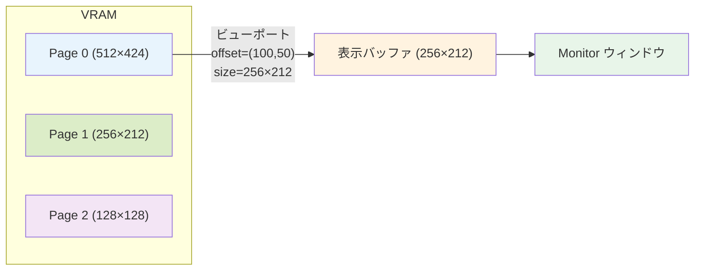

# 013: VRAMビューポート — ページ単位サイズ管理とモニタ解像度の分離

## 背景 (Background)

現在、VRAMModule と MonitorModule はともに **256×212** のサイズをハードコードしており、両者が同一サイズであることを暗黙の前提としている。

```go
// vram.go - New()
w, h := 256, 212

// monitor.go - New()
w, h := 256, 212
```

さらに、`VRAMModule` はモジュール全体で単一の `width`/`height` を持ち、すべてのページが同一サイズであることが前提となっている。

```go
type VRAMModule struct {
    width  int            // 全ページ共通
    height int            // 全ページ共通
    pages  []pageBuffer   // pageBuffer は index[] と color[] のみ
}
```

この設計では以下の制約がある:

- **VRAMサイズの柔軟性がない**: VRAMはモニタの解像度と同一サイズでしか確保できない。大きなマップやスクロール可能な画面を実現するためには、VRAMをモニタよりも大きく確保する必要がある。
- **ページごとのサイズ差異を表現できない**: 例えば、描画用ページは大きく、UIオーバーレイ用ページは小さく、という使い分けができない。全ページが同一サイズであるため、小さいデータしか持たないページでも大きなバッファが確保され、メモリが無駄になる。
- **スクロール表現ができない**: VRAMの一部領域をモニタに表示する「ビューポート」の概念がないため、描画領域のオフセットによるスクロール表現が不可能。
- **解像度の独立性がない**: VRAMバッファの論理的なサイズと、モニタに表示する物理的な解像度が常に一致する必要がある。

レトロコンピュータやゲーム機では、VRAMが画面解像度よりも大きく、表示領域のオフセットを変えることでスクロールを実現する仕組みが一般的であり、この機能は自然な拡張である。

## 要件 (Requirements)

### 必須要件

#### R1: ページ単位のサイズ管理

- `pageBuffer` を拡張し、各ページが独自の **幅 (width)** と **高さ (height)** を持つようにする。
- `VRAMModule` のグローバルな `width`/`height` フィールドを廃止する。
- 描画操作（`draw_pixel`, `blit_rect`, `copy_rect` 等）は、対象ページの `width`/`height` を参照してインデックス計算・クリッピングを行う。
- `New()` で生成されるデフォルトページ（page 0）のサイズは従来通り 256×212 とし、後方互換性を維持する。

#### R2: ページサイズ変更のバスコマンド

個々のページのサイズを実行時に変更するバスコマンドを追加する:

| コマンド (Target) | Data フォーマット | 説明 |
|---|---|---|
| `set_page_size` | `[page:u8][width_hi:u8][width_lo:u8][height_hi:u8][height_lo:u8]` (5 bytes, uint16 BE) | 指定ページのサイズを変更する |

| イベント (Target) | Data フォーマット | 説明 |
|---|---|---|
| `page_size_changed` | `[page:u8][width_hi:u8][width_lo:u8][height_hi:u8][height_lo:u8]` (5 bytes, uint16 BE) | ページサイズ変更を通知 |

- サイズ変更時、対象ページのバッファは新サイズで再確保し、**内容はクリアされる**。
- 表示ページのサイズが変更された場合、ビューポートオフセットは (0, 0) にリセットされる。
- 不正なページ番号の場合は `page_error` を発行する。

#### R3: ページ追加時のデフォルトサイズ

- `set_page_count` で新ページが追加される場合、新規ページのサイズはデフォルト値（256×212）で作成される。
- 既存の `set_page_count` のワイヤフォーマットは変更しない（後方互換維持）。

#### R4: ページ間操作のサイズ差異対応

ページ間で異なるサイズを持つ場合の各操作の動作を定義する:

- **`copy_page`**: ソースページの内容をデスティネーションページにコピーする。デスティネーションページは**ソースページと同じサイズにリサイズ**された上で、内容がコピーされる。
- **`swap_pages`**: ページオブジェクトごとスワップするため、サイズの違いは問題にならない（従来通り）。
- **`copy_rect`**: ソースページとデスティネーションページそれぞれの `width`/`height` を使ってクリッピングを行う。ソース側はソースページの範囲で、デスティネーション側はデスティネーションページの範囲でクリップする。

#### R5: モニタ解像度の独立設定

- MonitorModule の初期化時に、**表示解像度 (display width / display height)** を指定できるようにする。
- デフォルト値は従来通り 256×212 とし、後方互換性を維持する。
- モニタ解像度は、VRAMの表示ページの中の「表示する範囲」のサイズを決定する。

#### R6: 表示オフセット（ビューポート）の設定

- VRAMModule に**表示オフセット (offset X / offset Y)** を追加する。
- オフセットは、VRAMの表示ページ上の「モニタに表示する領域の左上座標」を表す。
- 初期値は (0, 0) とする。
- バスコマンドで動的に変更可能とする。

| コマンド (Target) | Data フォーマット | 説明 |
|---|---|---|
| `set_viewport` | `[offsetX_hi:u8][offsetX_lo:u8][offsetY_hi:u8][offsetY_lo:u8]` (4 bytes, int16 BE) | 表示オフセットを設定する |

| イベント (Target) | Data フォーマット | 説明 |
|---|---|---|
| `viewport_changed` | `[offsetX_hi:u8][offsetX_lo:u8][offsetY_hi:u8][offsetY_lo:u8]` (4 bytes, int16 BE) | オフセット変更を通知 |

- オフセット値は **int16**（符号付き16ビット整数）とし、負の値も許容する。
- バイトオーダーは既存のプロトコルに合わせて **ビッグエンディアン (BE)** とする。

#### R7: ビューポートのクリッピング動作

- 表示オフセットとモニタ解像度により定義される表示矩形が、表示ページの範囲を超える場合の動作を定義する:
  - **クリップモード（デフォルト）**: 表示ページの範囲外に該当するピクセルは、パレットインデックス 0 の色（背景色）で埋める。
- オフセットに負の値を設定した場合も、同様にクリップして表示する。

#### R8: VRAMAccessor インターフェースの拡張

MonitorModule が直接アクセスモード（`VRAMAccessor`）で動作する場合にも、ビューポート情報と表示ページのサイズを取得できるようにする:

- `VRAMAccessor` インターフェースに以下を追加:
  - ビューポートオフセットを取得するメソッド
  - 表示ページのサイズ（width, height）を取得するメソッド
- MonitorModule は `refreshFromVRAM()` 時に、表示ページのサイズとビューポートを考慮して表示バッファに反映する。

#### R9: VRAMWidth / VRAMHeight の互換対応

- 既存の `VRAMWidth()` / `VRAMHeight()` メソッドは、**表示ページのサイズ**を返すように変更する。
- これにより、MonitorModule 等の既存コードが表示ページのサイズを参照する動作を維持する。

#### R10: blit 系コマンドから src_page を廃止

現在の `blit_rect` および `blit_rect_transform` コマンドは `src_page` パラメータを持っているが、これは本来の「ソースページ」ではなく、ブレンド時の背景ピクセル読み取り元として使われている。`blit` は外部データをVRAMに書き込む操作であり、ブレンド背景はデスティネーションページ自身から読むのが自然である。

- `blit_rect` から `src_page` パラメータを削除する。
- `blit_rect_transform` から `src_page` パラメータを削除する。
- ブレンド処理時の背景ピクセルは `dst_page` から読み取る。

**ワイヤフォーマット変更:**

| コマンド | 変更前 | 変更後 |
|---|---|---|
| `blit_rect` | `[src_page:u8][dst_page:u8][dst_x:u16][dst_y:u16][w:u16][h:u16][blend_mode:u8][pixel_data...]` (11+ bytes) | `[dst_page:u8][dst_x:u16][dst_y:u16][w:u16][h:u16][blend_mode:u8][pixel_data...]` (10+ bytes) |
| `blit_rect_transform` | `[src_page:u8][dst_page:u8][dst_x:u16]...` (20+ bytes) | `[dst_page:u8][dst_x:u16]...` (19+ bytes) |

**ブレンド処理の変更:**

```go
// Before: src_page から背景を読み取り
dstRGBA := [4]uint8{
    v.pages[srcPage].color[dstIdx*4], ...
}

// After: dst_page から背景を読み取り（自然な動作）
dstRGBA := [4]uint8{
    v.pages[dstPage].color[dstIdx*4], ...
}
```

### 任意要件

#### O1: ラップアラウンドモード（将来拡張）

- 表示矩形がVRAM範囲外にはみ出した場合に、VRAMの反対側から読み取る「ラップアラウンド」モードは、将来的な拡張として検討する。本仕様では実装しない。

## 実現方針 (Implementation Approach)

### pageBuffer の拡張

```go
type pageBuffer struct {
    width  int
    height int
    index  []uint8 // palette index buffer (width * height)
    color  []uint8 // RGBA color buffer (width * height * 4)
}

func newPageBuffer(w, h int) pageBuffer {
    return pageBuffer{
        width:  w,
        height: h,
        index:  make([]uint8, w*h),
        color:  make([]uint8, w*h*4),
    }
}
```

### VRAMModule の変更

```go
type VRAMModule struct {
    mu          sync.RWMutex
    // width, height フィールドを削除
    color       int
    pages       []pageBuffer
    displayPage int
    viewportX   int // 表示オフセットX（int16 範囲）
    viewportY   int // 表示オフセットY（int16 範囲）
    palette     [256][4]uint8
    bus         bus.Bus
    wg          sync.WaitGroup
}
```

- `v.width` / `v.height` への参照をすべて `v.pages[targetPage].width` / `v.pages[targetPage].height` に置き換える。
- `ClipRect` 呼び出し時のサイズ引数を、対象ページのサイズに変更する。
- `collectIndexData` / `collectRGBAData` もページのサイズを参照するよう変更する。

### 既存コマンドへの影響

| コマンド | 変更内容 |
|---|---|
| `draw_pixel` | `v.width`/`v.height` → `v.pages[dstPage].width`/`v.pages[dstPage].height` |
| `clear_vram` | 対象ページの `width`/`height` を参照 |
| `blit_rect` | `src_page` 廃止、`ClipRect` に `dst_page` のサイズを使用、ブレンド背景を `dst_page` から読み取り |
| `read_rect` | ソースページのサイズを参照 |
| `copy_rect` | ソース/デスティネーションそれぞれのページサイズを使用 |
| `blit_rect_transform` | `src_page` 廃止、`ClipRect` に `dst_page` のサイズを使用、ブレンド背景を `dst_page` から読み取り |
| `mode` | 各ページを自身のサイズで再確保 |
| `set_page_count` | 新規ページはデフォルトサイズ (256×212) で作成 |
| `copy_page` | デスティネーションをソースと同サイズにリサイズしてからコピー |

### VRAMAccessor インターフェースの拡張

```go
type VRAMAccessor interface {
    // 既存メソッド
    RLock()
    RUnlock()
    VRAMBuffer() []uint8
    VRAMColorBuffer() []uint8
    VRAMPalette() [256][4]uint8
    VRAMWidth() int
    VRAMHeight() int
    // 新規メソッド
    ViewportOffset() (x, y int)
}
```

- `VRAMWidth()` / `VRAMHeight()` は表示ページのサイズを返す（R9）。
- `ViewportOffset()` はビューポートオフセットを返す。

### MonitorModule の変更

- `MonitorConfig` に表示解像度フィールドを追加（デフォルト 256×212）。
- `refreshFromVRAM()` を修正し、`ViewportOffset()` と表示ページのサイズに基づいてクリッピングしながら表示バッファに反映する。
- バスモードでは `viewport_changed` / `page_size_changed` イベントを購読して状態を追跡する。

### 全体の処理フロー



1. 各ページは独自のサイズを持つ
2. 表示ページ（displayPage）がモニタに出力される
3. `set_viewport` で表示ページ上の表示開始位置を指定する
4. MonitorModule は表示ページの (offsetX, offsetY) から (offsetX+displayW, offsetY+displayH) の範囲を読み取る
5. 表示ページの範囲外に該当するピクセルはパレットインデックス 0 で埋める

## 検証シナリオ (Verification Scenarios)

### シナリオ1: デフォルトサイズでの後方互換

1. VRAMを `New()` で初期化する（デフォルト page 0 = 256×212）
2. MonitorModuleをデフォルト設定で初期化する
3. 従来と同じ描画操作（`draw_pixel`, `blit_rect` 等）を実行する
4. 既存のテストがすべてパスすることを確認する

### シナリオ2: ページ単位のサイズ設定

1. VRAMを初期化し、page 0 のサイズを `set_page_size` で 512×424 に変更する
2. `page_size_changed` イベントが発行されることを確認する
3. page 0 に (300, 300) のピクセルを描画できることを確認する（元の 256×212 では範囲外）
4. page 0 の (256, 212) 以降の座標が有効であることを確認する

### シナリオ3: 異なるサイズのページの共存

1. VRAMを初期化し、ページ数を 3 に設定する
2. page 0 を 512×424 に、page 1 を 256×212（デフォルトのまま）、page 2 を 128×128 に設定する
3. 各ページに描画操作を行い、各ページの範囲内でのみ描画されることを確認する
4. 各ページの範囲外へのアクセスが無視されることを確認する

### シナリオ4: ビューポートオフセットによるスクロール

1. page 0 を 512×424 で設定する
2. page 0 の (300, 200) にピクセルを描画する
3. `set_viewport` で (200, 100) にオフセットを設定する
4. MonitorModule の表示バッファ (256×212) の (100, 100) にそのピクセルが反映されることを確認する

### シナリオ5: ビューポートのクリッピング

1. page 0 を 256×212 で設定する
2. page 0 の (250, 0) にピクセルを描画する
3. `set_viewport` で (200, 0) にオフセットを設定する
4. MonitorModule の表示バッファ:
   - (50, 0) にそのピクセルが表示される
   - (56, 0) 以降（ページの範囲外）はパレットインデックス 0 の色で埋まる

### シナリオ6: 負のオフセットでのクリッピング

1. page 0 を 256×212 で設定する
2. page 0 の (0, 0) にピクセルを描画する
3. `set_viewport` で (-10, -5) にオフセットを設定する
4. MonitorModule の表示バッファの (10, 5) にそのピクセルが表示される
5. (0,0)-(9,4) の領域はパレットインデックス 0 の色で埋まる

### シナリオ7: 異なるサイズのページ間 copy_page

1. page 0 を 512×424 に設定し、ピクセルを描画する
2. page 1 を 256×212（デフォルト）のままにする
3. `copy_page` で page 0 → page 1 にコピーする
4. page 1 のサイズが 512×424 にリサイズされ、page 0 の内容がコピーされることを確認する

### シナリオ8: 異なるサイズのページ間 copy_rect

1. page 0 を 512×424 に、page 1 を 128×128 に設定する
2. page 0 の (0,0)-(127,127) に描画する
3. `copy_rect` で page 0 の (0,0) → page 1 の (0,0) にサイズ 200×200 でコピーする
4. page 1 の範囲 (128×128) にクリップされ、(0,0)-(127,127) の範囲のみがコピーされることを確認する

### シナリオ9: VRAMAccessor 直接アクセスモードでのビューポート

1. page 0 を 512×424 に設定する
2. MonitorModule に VRAMAccessor を設定する（直接アクセスモード）
3. VRAMにピクセルを描画し、`set_viewport` でオフセットを設定する
4. MonitorModule の `refreshFromVRAM()` で、ビューポート範囲のみが正しく読み取られることを確認する

### シナリオ10: blit_rect の src_page 廃止後のブレンド動作

1. page 0 にパレットインデックス 5 のピクセルを (10, 10) に描画する
2. `blit_rect` を新フォーマット（`src_page` なし）で、page 0 の (10, 10) にブレンドモード付きで別のピクセルを書き込む
3. ブレンド結果が、page 0 の既存ピクセル（パレットインデックス 5）を背景として正しく計算されることを確認する

### シナリオ11: 表示ページのサイズ変更時のビューポートリセット

1. page 0 を 512×424 に設定し、`set_viewport` で (100, 50) にオフセットを設定する
2. `set_page_size` で page 0 のサイズを 256×212 に変更する
3. ビューポートオフセットが (0, 0) にリセットされることを確認する

### シナリオ12: ダブルバッファ＋大マップによる全画面回転・拡大・スクロール デモ

本仕様の各機能を組み合わせ、擬似的な全画面回転・拡大縮小・スクロールを実現するデモシナリオ。

**ページ構成:**

```
Page 0 (256×212) ─┐
                   ├─ ダブルバッファ（交互に display_page を切替）
Page 1 (256×212) ─┘

Page 2 (1024×1024) ─ 広大なマップデータ
```

**セットアップ:**

1. `set_page_count` でページ数を 3 に設定する
2. page 0, page 1 はデフォルトサイズ (256×212) のまま
3. `set_page_size` で page 2 を 1024×1024 に設定する
4. page 2 にマップ全体のパターンを `blit_rect` で描画する
   - 例: 市松模様 + 十字のランドマーク等、位置が視覚的に判別できるパターン
5. `set_display_page` で page 0 を表示ページに設定する

**フレーム描画ループ（3フレーム分のシミュレーション）:**

フレーム1: スクロールのみ（回転なし）
1. `read_rect` で page 2 の (0, 0) から 256×212 を読み取る
2. `rect_data` イベントで返されたピクセルデータを取得する
3. `blit_rect` で page 1 の (0, 0) にそのデータを書き込む（変換なし）
4. `set_display_page` で page 1 に切り替える
5. 検証: page 1 の内容が page 2 の (0,0)-(255,211) と一致すること

フレーム2: スクロール位置変更
1. `read_rect` で page 2 の (400, 300) から 256×212 を読み取る
2. `rect_data` イベントで返されたピクセルデータを取得する
3. `blit_rect` で page 0 の (0, 0) にそのデータを書き込む
4. `set_display_page` で page 0 に切り替える
5. 検証: page 0 の内容が page 2 の (400,300)-(655,511) と一致すること

フレーム3: スクロール＋回転＋拡大
1. `read_rect` で page 2 の (200, 200) から 256×212 を読み取る
2. `rect_data` イベントで返されたピクセルデータを取得する
3. `blit_rect_transform` で page 1 に書き込む
   - rotation: 45度相当、scale: 1.5倍
   - dst: (0, 0)、pivot: 画像中央
4. `set_display_page` で page 1 に切り替える
5. 検証: page 1 の内容が、page 2 の (200,200) 付近のデータを 45度回転・1.5倍拡大した結果と一致すること

**検証ポイント:**

- ダブルバッファリングにより、表示切替時にちらつき（描画途中の表示）が発生しないこと
- 異なるサイズのページ（256×212 と 1024×1024）が共存して正しく動作すること
- `read_rect` → `blit_rect_transform` のパイプラインで、回転・拡大＋スクロールが実現できること
- 各フレームで `set_display_page` による瞬時切替が行われること

## テスト項目 (Testing for the Requirements)

### 単体テスト

| 要件 | テストファイル | テスト内容 | 検証コマンド |
|---|---|---|---|
| R1 | `vram/vram_test.go` | `pageBuffer` が `width`/`height` を保持すること、デフォルト `New()` の後方互換性 | `scripts/process/build.sh` |
| R1 | `vram/vram_test.go` | 各描画コマンドがページのサイズを正しく参照すること | `scripts/process/build.sh` |
| R2 | `vram/vram_test.go` | `set_page_size` によるバッファ再確保・クリア・イベント発行 | `scripts/process/build.sh` |
| R3 | `vram/vram_test.go` | `set_page_count` で新ページがデフォルトサイズで作成されること | `scripts/process/build.sh` |
| R4 | `vram/vram_test.go` | `copy_page` のリサイズ動作、`copy_rect` の異なるサイズ間クリッピング | `scripts/process/build.sh` |
| R6 | `vram/vram_test.go` | `set_viewport` コマンドでオフセットが正しく設定される | `scripts/process/build.sh` |
| R7 | `vram/vram_test.go` | ビューポート情報が正しく返る | `scripts/process/build.sh` |
| R8 | `vram/vram_test.go` | VRAMAccessor の新メソッド実装確認 | `scripts/process/build.sh` |
| R9 | `vram/vram_test.go` | `VRAMWidth()`/`VRAMHeight()` が表示ページのサイズを返す | `scripts/process/build.sh` |
| R10 | `vram/vram_test.go` | `blit_rect`/`blit_rect_transform` の新ワイヤフォーマット（`src_page` なし）で正しく動作すること | `scripts/process/build.sh` |
| R10 | `vram/vram_test.go` | ブレンド時に `dst_page` の既存ピクセルを背景として使用すること | `scripts/process/build.sh` |
| R5, R7 | `monitor/monitor_test.go` | MonitorModule のビューポートクリッピング表示 | `scripts/process/build.sh` |

### 統合テスト

| 要件 | テストファイル | テスト内容 | 検証コマンド |
|---|---|---|---|
| R1-R3 | `integration/vram_viewport_test.go` | ページ単位サイズ管理の基本動作 | `scripts/process/integration_test.sh` |
| R1 | `integration/vram_viewport_test.go` | デフォルトサイズでの既存機能後方互換 | `scripts/process/integration_test.sh` |
| R4 | `integration/vram_viewport_test.go` | 異なるサイズのページ間操作 | `scripts/process/integration_test.sh` |
| R5-R7 | `integration/vram_viewport_test.go` | VRAM＋Monitor連携でのビューポート表示 | `scripts/process/integration_test.sh` |
| R6-R7 | `integration/vram_viewport_test.go` | オフセット設定→表示バッファの正しいクリッピング | `scripts/process/integration_test.sh` |
| R2, R8 | `integration/vram_viewport_test.go` | バスコマンドによるページサイズ動的変更とイベント伝搬 | `scripts/process/integration_test.sh` |
| R10 | `integration/vram_viewport_test.go` | `blit_rect`/`blit_rect_transform` の新フォーマットでの描画・ブレンド動作 | `scripts/process/integration_test.sh` |
| R1-R4, R10 | `integration/vram_viewport_test.go` | ダブルバッファ＋大マップによる全画面回転・拡大・スクロール デモ | `scripts/process/integration_test.sh` |
